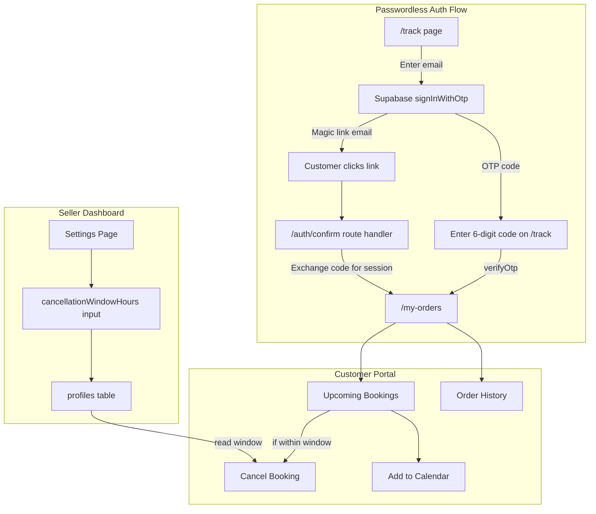

# Customer Portal Implementation

## Architecture Overview




## 1. Schema Change -- Add `cancellationWindowHours` to profiles

**File:** [src/db/schema.ts](src/db/schema.ts)

Add one column to the `profiles` table:

```typescript
cancellationWindowHours: integer("cancellation_window_hours").default(24),
```

Then run `drizzle-kit generate` to create the migration. This column defaults to 24 hours and controls how far in advance a customer can cancel.

## 2. Auth Callback Route -- `/auth/confirm`

**New file:** `src/app/auth/confirm/route.ts`

A GET route handler that:

- Reads the `token_hash` and `type` query params from the Supabase magic link URL
- Calls `supabase.auth.verifyOtp({ token_hash, type })` to exchange for a session
- Reads optional `next` param (defaults to `/my-orders`)
- Redirects to the `next` URL on success, or `/track?error=auth` on failure

This uses the existing server client from [src/lib/supabase/server.ts](src/lib/supabase/server.ts).

## 3. Middleware Update -- Protect `/my-orders`

**File:** [src/lib/supabase/middleware.ts](src/lib/supabase/middleware.ts)

Add a check: if the path starts with `/my-orders` and there is no authenticated user, redirect to `/track`. This is separate from the `/dashboard` -> `/login` redirect for sellers. No onboarding check needed for customers.

## 4. Customer Login Page -- `/track`

**New files:**

- `src/app/track/page.tsx` -- Server component (minimal wrapper)
- `src/app/track/TrackClient.tsx` -- Client component

**Flow:**

- Step 1: Email input form. Calls `supabase.auth.signInWithOtp({ email, options: { emailRedirectTo: origin + '/auth/confirm?next=/my-orders' } })` from the browser client.
- Step 2: After sending, show OTP input (6 digits). Customer can either enter the code or click the magic link.
- On OTP submit: call `supabase.auth.verifyOtp({ email, token, type: 'email' })`. On success, `router.push('/my-orders')`.
- Accept optional `?email=` query param to pre-fill (used from post-booking success page).
- Dark UI matching the existing design system. RTL, Persian labels.

## 5. Customer Server Actions

**New file:** `src/app/actions/customer.ts`

Three actions, all reading the authenticated user's email from the Supabase session:

- `**getCustomerBookingsAndOrders()**`: Queries `bookings` and `orders` tables where `customerEmail` matches the logged-in user's email. Returns upcoming bookings (sorted by startTime ASC) and past orders. Joins with `items` for service name and `profiles` for seller/shop name.
- `**cancelBookingByCustomer(bookingId, reason?)**`: The priority action.
  - Authenticates the user via Supabase session.
  - Fetches the booking; verifies `customerEmail` matches.
  - Fetches the seller's `cancellationWindowHours` from `profiles`.
  - **Enforcement logic:**
    ```
    hoursUntilAppointment = (booking.startTime - Date.now()) / (1000 * 60 * 60)
    if (hoursUntilAppointment < cancellationWindowHours) → reject
    ```
  - Uses a DB transaction: sets `bookings.status = 'cancelled'`, `cancelledAt = now`, and syncs the linked order status to `'cancelled'` if `orderId` exists.
  - Calls `revalidatePath('/my-orders')`.
- `**generateCalendarUrl(bookingId)**`: Returns a Google Calendar URL with service name, time, and seller name encoded as query params.

## 6. Customer Portal -- `/my-orders`

**New files:**

- `src/app/my-orders/page.tsx` -- Server component that checks auth, fetches data via `getCustomerBookingsAndOrders()`, renders client component.
- `src/app/my-orders/MyOrdersClient.tsx` -- Client component.

**UI sections:**

- **Header**: "سفارش‌های من" with logout button
- **Upcoming Bookings**: Cards with service name, seller name, date/time (Persian formatted), status badge. Each card has:
  - "Add to Calendar" button (Google Calendar link, opens in new tab)
  - "Cancel" button -- shown only if `hoursUntilAppointment >= cancellationWindowHours`. Otherwise show disabled button with tooltip: "لغو فقط تا [X] ساعت قبل از نوبت امکان‌پذیر است"
  - Cancel triggers the `ConfirmModal` (reuse existing [src/components/ConfirmModal.tsx](src/components/ConfirmModal.tsx))
- **Order History**: Cards with order number, date, total, status badge. Collapsible item details.
- **Empty State**: Illustration-style message "هنوز سفارشی ندارید" with a CTA button back to the shop.
- Uses `sonner` toasts for cancel success/error feedback.

## 7. Seller Dashboard Settings -- Cancellation Window

**Files to modify:**

- [src/app/dashboard/settings/StoreSettingsClient.tsx](src/app/dashboard/settings/StoreSettingsClient.tsx) -- Add a "بازه لغو نوبت" (Cancellation Window) input field in the Store tab, with a dropdown or number input for hours (e.g., 2, 6, 12, 24, 48). Pass to the settings action.
- [src/app/actions/settings.ts](src/app/actions/settings.ts) -- Update `updateProfileSettings` to accept and persist `cancellationWindowHours`.
- [src/app/dashboard/settings/page.tsx](src/app/dashboard/settings/page.tsx) -- Pass `cancellationWindowHours` from the profile to the client component's `initial` prop.

## 8. Post-Booking Success -- "View Your Booking" CTA

**File to modify:** [src/components/ShopSuccessClient.tsx](src/components/ShopSuccessClient.tsx)

Add a "مشاهده نوبت‌های من" (View My Bookings) button/link that navigates to `/track?email={customerEmail}`. This pre-fills the email on the track page so the customer can quickly authenticate and see their booking. The `customerEmail` will be passed as a prop from the success page server component.

## 9. Migration

Run `drizzle-kit generate` after the schema change to produce the SQL migration file for the new `cancellation_window_hours` column. Then apply it.

## File Summary


| Action | Path                                                 |
| ------ | ---------------------------------------------------- |
| Modify | `src/db/schema.ts`                                   |
| Create | `src/app/auth/confirm/route.ts`                      |
| Modify | `src/lib/supabase/middleware.ts`                     |
| Create | `src/app/track/page.tsx`                             |
| Create | `src/app/track/TrackClient.tsx`                      |
| Create | `src/app/actions/customer.ts`                        |
| Create | `src/app/my-orders/page.tsx`                         |
| Create | `src/app/my-orders/MyOrdersClient.tsx`               |
| Modify | `src/app/dashboard/settings/StoreSettingsClient.tsx` |
| Modify | `src/app/dashboard/settings/page.tsx`                |
| Modify | `src/app/actions/settings.ts`                        |
| Modify | `src/components/ShopSuccessClient.tsx`               |


